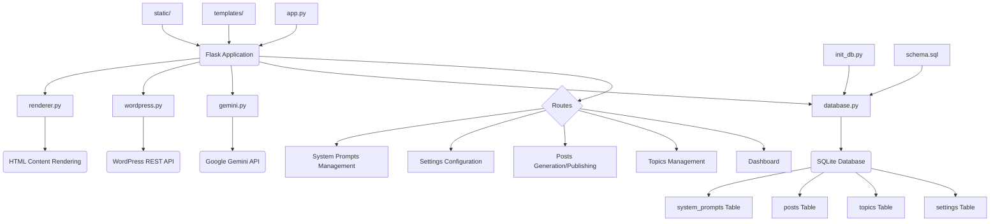

# Ai WP Flask: AI-Powered WordPress Content Generator

## Project Overview

Ai WP Flask is a Flask-based web application designed to streamline the creation and publishing of blog posts to WordPress using the Google Gemini API. It provides a user-friendly interface to manage topics, generate content with customizable system prompts, and directly publish to a connected WordPress site.

## Features

*   **AI-Powered Content Generation**: Leverage the Google Gemini API to generate high-quality blog post titles, content, meta descriptions, and keywords based on user prompts and predefined system instructions.
*   **WordPress Integration**: Seamlessly publish generated content directly to your WordPress site, including support for categories, tags, and featured images.
*   **Topic Management**: Organize your content ideas by creating and managing topics with associated categories and statuses.
*   **Customizable System Prompts**: Define and manage various system prompts (personas, tones, audiences, etc.) to guide the AI in generating tailored content.
*   **Database Management**: SQLite database for storing application settings, topics, and system prompts.
*   **Content Rendering**: Custom rendering of special tags (e.g., `[CODE]`, `[INFO]`, `[NOTE]`) into HTML for enhanced content presentation.

## Project Structure



## Technologies Used

*   **Backend**: Python, Flask
*   **Database**: SQLite
*   **AI Integration**: Google Gemini API
*   **CMS Integration**: WordPress REST API
*   **Frontend**: HTML, CSS, JavaScript (with TinyMCE for rich text editing)

## Installation and Setup

### Prerequisites

*   Python 3.x
*   pip (Python package installer)
*   A WordPress site with REST API enabled.
*   A Google Cloud project with the Gemini API enabled and an API key.

### Steps

1.  **Clone the repository:**
    ```bash
    git clone <repository_url>
    cd Ai-WP-Flask
    ```
    *(Note: Replace `<repository_url>` with the actual repository URL)*

2.  **Create a virtual environment (recommended):**
    ```bash
    python -m venv venv
    source venv/bin/activate  # On Windows: `venv\Scripts\activate`
    ```

3.  **Install dependencies:**
    ```bash
    pip install -r requirements.txt
    ```
    *(Note: A `requirements.txt` file is assumed to exist. If not, list required packages like `Flask`, `google-generativeai`, `python-wordpress-xmlrpc`)*

4.  **Initialize the database:**
    ```bash
    python init_db.py
    ```
    This will create `database.db` and set up the necessary tables.

5.  **Run the application:**
    ```bash
    python app.py
    ```

6.  **Access the application:**
    Open your web browser and navigate to `http://127.0.0.1:5000/`.

7.  **Configure Settings:**
    Go to the `/settings` page to enter your Google Gemini API key and WordPress site details (URL, username, password).

## Usage

1.  **Dashboard**: Overview of your content generation activities.
2.  **Topics**: Manage your content ideas. Add new topics, assign categories, and update their status.
3.  **Posts**: Generate new blog posts using AI. Select a topic, provide a prompt, choose a system prompt, and generate content. You can then publish the generated content directly to WordPress.
4.  **System Prompts**: Create, edit, and delete custom system prompts to guide the AI's content generation based on specific personas, tones, or content goals.

## Contributing

(Optional section for contribution guidelines)

## License

(Optional section for licensing information)